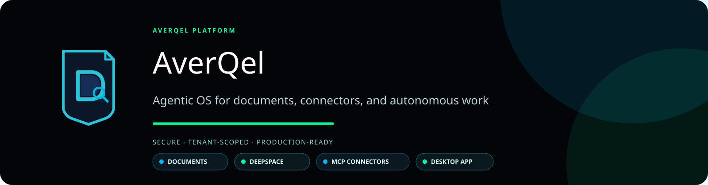

<p align="center">
  
</p>

<p align="center">
  <a href="https://github.com/sainibhaowal/AverQel/actions/workflows/ci.yml"></a>
  <a href="https://github.com/sainibhaowal/AverQel/releases"></a>
  <a href="LICENSE"></a>
  <a href="https://averqel.com"></a>
</p>

# AverQel

**AverQel is an open-source agentic workspace for documents, knowledge,
connectors, and autonomous work.**

It brings document intelligence, DeepSpace agent workflows, reviewed MCP
connections, and web/desktop clients into one secure, extensible platform.

> The project is actively developed. Some integrations and deployment features
> require operator configuration and are clearly marked in the documentation.

## What AverQel provides

- **Documents Hub** - private ingestion, OCR, malware scanning, indexing,
  previews, versions, search, and governed document workflows.
- **DeepSpace** - plan-aware agent execution with memory, tool calls,
  approvals, durable activity, and bounded parallel work.
- **MCP Marketplace** - reviewed remote connectors with OAuth, encrypted
  per-user credentials, catalog discovery, policy checks, and risk controls.
- **Web workspace** - a Next.js application for documents, chat, providers,
  DeepSpace, settings, and administration.
- **Electron desktop app** - distributable Linux `.deb`/`.rpm`, Windows `.exe`,
  and macOS `.dmg` packages using the shared product experience.
- **Production delivery** - versioned Docker images, health checks,
  vulnerability scanning, SBOMs, image signing, checksums, and rollback-aware
  VPS deployment.

## Architecture

The following diagram describes the services in
[`backend/docker-compose.prod.yml`](backend/docker-compose.prod.yml). It
shows service boundaries and network dependencies, not a claim that every
optional provider is included in the repository.

```text
Users
  |
  +--> Browser ------------------------------+
  |                                          |
  +--> Electron desktop client               |
       packaged: https://averqel.com         |
       development: 127.0.0.1:1030          |
                                             v
                                  +----------------------+
                                  | frontend              |
                                  | Next.js, port 1030    |
                                  +----------+-----------+
                                             | NEXT_PROXY_TARGET
                                             v
                                  +----------------------+
                                  | api                   |
                                  | FastAPI, port 1000    |
                                  +---+-----+------+-----+
                                      |     |      |
                         +------------+     |      +--> searxng:8080
                         |                  |           server-side search
                         v                  v
                  postgres:5432       redis:6379
                  durable data        queues and events
                         ^                  ^
                         |                  |
              +----------+------------------+----------+
              | worker roles: inference, worker,      |
              | ingestion, maintenance, MCP, scheduler |
              +------------------+---------------------+
                                 |
                    +------------+-------------+
                    v                          v
              minio:9000                  clamav:3310
              private objects              malware scanning

              inference:1011
              local model inference for API and workers

External boundaries: OAuth providers, approved MCP servers, model providers,
and other integrations are reached by the backend. Credentials and provider
responses do not pass through the Electron process as secrets.
```

### Service responsibilities

| Service or boundary | Runtime role |
| --- | --- |
| `frontend` | Serves the Next.js application and proxies configured API requests. |
| `api` | Authenticated FastAPI endpoints, migrations, catalog seeding, and request orchestration. |
| `worker` | Celery execution for DeepSpace and background queues. |
| `inference` | Offline local model inference on port `1011`. |
| `scheduler` | Celery Beat scheduling, or the optional proactive daemon. |
| `mcp-worker` | Dedicated MCP catalog and connector background queue. |
| `ingestion-worker` | Heavy and light document-ingestion queues. |
| `maintenance-worker` | Maintenance queue isolated from user-facing work. |
| `postgres` | Relational state, tenant metadata, and authorization records. |
| `redis` | Celery broker and transient coordination state. |
| `minio` | Private document and artifact object storage. |
| `clamav` | Malware scanning for uploaded or processed files. |
| `searxng` | Server-side web-search service used by the configured provider path. |
| `backend/ops/livekit` | Separate LiveKit server image materials. The current checked-in Compose files do not start this service. |

The self-hosted LiveKit package therefore requires a separate deployment
service definition, configuration, and RTC port policy before it can be used
as the production voice server. The Python LiveKit client dependencies alone
do not start a LiveKit server.

The main components are:

| Component | Location | Responsibility |
| --- | --- | --- |
| Web application | `frontend/` | Next.js UI, dashboard, landing page, and browser flows |
| API and workers | `backend/` | Authenticated APIs, document processing, agents, and jobs |
| Desktop client | `applications/desktop/` | Electron packaging for supported platforms |
| CI/CD | `.github/workflows/` | PR quality gates, manual releases, and manual deployment |
| Operations docs | `Docs/` | Local setup, Docker, MCP, release, and VPS procedures |

## Quick start

### Requirements

- Node.js 22
- pnpm 10.28.2
- Python 3.12 for backend development
- Docker Engine and Docker Compose for local services
- Provider credentials only when using the related integration

Enable the pinned package manager:

```bash
corepack enable
corepack prepare pnpm@10.28.2 --activate
```

Install the web and desktop dependencies:

```bash
pnpm --dir frontend install --frozen-lockfile
pnpm --dir applications/desktop install --frozen-lockfile
```

Start the local web experience with Electron:

```bash
pnpm electron dev
```

The default local frontend is `http://127.0.0.1:1030`. For local HTTPS or a
local production-like API, use the environment instructions in the
[Electron guide](applications/desktop/README.md) and the public
[documentation index](Docs/README.md).

### Backend and services

Backend setup is intentionally documented separately because it includes
databases, Redis, object storage, OCR, malware scanning, model assets, and
environment-specific secrets. Start with the [documentation index](Docs/README.md).

Never commit `.env` files, provider secrets, OAuth credentials, SSH keys, or
model files.

## Development workflow

1. Fork or clone the repository.
2. Create a short-lived branch from the latest `main`.
3. Make a focused change with tests and documentation.
4. Run the applicable local checks.
5. Open a pull request and wait for the required `CI Passed` check.
6. Address review feedback and merge only after approval.

`main` is protected. Direct pushes, force pushes, and unreviewed production
changes are not part of the normal contribution path.

See [CONTRIBUTING.md](CONTRIBUTING.md) for coding rules, commit style,
security boundaries, and pull request requirements.

## Quality checks

The PR workflow classifies changed paths and runs backend and frontend gates in
parallel. Dependencies, Dockerfiles, migrations, shared configuration, and
workflow changes trigger full validation. Documentation-only changes avoid
heavy application suites. Superseded PR runs are cancelled automatically.

Common local checks:

```bash
# Frontend
pnpm --dir frontend lint
pnpm --dir frontend test
pnpm --dir frontend e2e
pnpm --dir frontend build

# Backend, from backend/ and its Python environment
cd backend
ruff check .
black --check .
mypy .
bandit -r app -q --severity-level medium
pytest -q -m unit_no_db --dist=loadgroup
pip-audit -s osv -r requirements.txt -r requirements-dev.txt
```

## Releases and deployment

Release and deployment are deliberately manual operations from protected
`main`:

1. **Release - Manual SemVer and Desktop** calculates the next
   `vMAJOR.MINOR.PATCH`, builds the desktop packages, creates checksums and a
   release manifest, and publishes the GitHub release assets.
2. **Deploy - Manual Docker Build and VPS** checks out the exact released
   commit, builds and tests API/worker/frontend images, scans them, generates
   SBOMs, signs images with keyless Cosign, publishes them to GHCR, and deploys
   the tested immutable images to the VPS.
3. The deployment verifies service health and the deployed version. Desktop
   packages remain in the GitHub Release and are not copied to the VPS. The
   previous application image remains available for rollback.

The landing page download buttons use GitHub's direct `latest/download` asset
URLs. They download the selected installer without opening the release page.

The workflow and operator details are documented in
[`.github/RELEASE_SECURITY.md`](.github/RELEASE_SECURITY.md) and the local
deployment runbook used by the VPS operator.

## MCP and provider security

MCP connections are opt-in and tenant/user scoped. OAuth credentials are
encrypted by the backend and are not returned to the browser, prompts, or
logs. Tool access is governed by provider approval, catalog freshness,
ownership, allowlists, risk ceilings, read-only mode, and approval rules.

AverQel currently supports approved remote Streamable HTTP and SSE providers.
Local processes, SSH servers, and arbitrary vendor repositories are not
automatically trusted. Read the [frontend integration guide](frontend/README.md)
and the documentation index before adding a provider.

## Documentation

- [Documentation index](Docs/README.md)
- [Frontend and DeepSpace guide](frontend/README.md)
- [Electron desktop guide](applications/desktop/README.md)
- [Security policy](SECURITY.md)
- [Support guide](SUPPORT.md)
- [Changelog](CHANGELOG.md)

## Security

Please report vulnerabilities privately through a GitHub Security Advisory.
Do not publish tokens, customer documents, production logs, or exploitable
details in an issue. Read [SECURITY.md](SECURITY.md) before reporting.

## License

AverQel is open source under the [Apache License 2.0](LICENSE). The license
allows use, modification, and redistribution under its terms and includes an
express patent grant. Third-party dependencies and bundled runtimes retain
their own licenses. AverQel trademarks and logos are not granted for unrelated
branding use by the Apache license. See [TRADEMARKS.md](TRADEMARKS.md),
[BRAND.md](BRAND.md), and [NOTICE](NOTICE) for the brand and attribution
policy.

## Community standards

Please follow the [Code of Conduct](CODE_OF_CONDUCT.md). Contributions are
welcome through reviewed pull requests.
