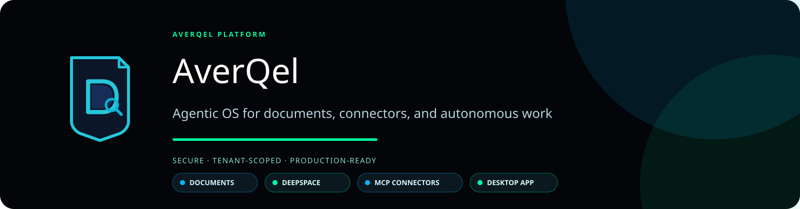

<p align="center">
  
</p>

<p align="center">
  <a href="https://github.com/sainibhaowal/AverQel/actions/workflows/ci.yml"></a>
  <a href="https://github.com/sainibhaowal/AverQel/releases"></a>
  <a href="LICENSE"></a>
  <a href="https://averqel.com"></a>
</p>

# AverQel

**AverQel is an open-source workspace for documents, knowledge, connected
tools, and AI-assisted work.** It combines a web and desktop workspace, a
tenant-aware API, background processing, and optional provider integrations.

The repository includes application code, local and production Compose files,
CI and release workflows, and operational documentation. A feature present in
the source is not by itself proof that it is enabled, externally configured,
or verified in a particular deployment. The [release and deployment section](#releases-and-deployment)
explains that distinction and the release path.

## Product capabilities

| Area                          | What it provides                                                                                                                                                          | Status and details                                                                                                                                                                                                                                                                                                                   |
| ----------------------------- | ------------------------------------------------------------------------------------------------------------------------------------------------------------------------- | ------------------------------------------------------------------------------------------------------------------------------------------------------------------------------------------------------------------------------------------------------------------------------------------------------------------------------------ |
| Documents Hub                 | Private document upload, malware scanning, OCR and extraction, indexing, search, previews, version history, sharing, collaboration, organization, and recovery workflows. | Requires the API, ingestion workers, private object storage, and configured malware scanner. See the [user guide](backend/docs/library/09-documents-hub-user-guide.md) and [production contract](backend/docs/library/05-documents-production.md).                                                                                   |
| Query                         | Retrieval-first questions over documents the authenticated user is allowed to access, with source references and query history.                                           | Depends on successfully processed sources and a configured answer provider; retrieval and generated answers can be incomplete. See [Grounded Query in the in-app documentation](frontend/app/documentation/grounded-query/page.tsx).                                                                                                 |
| DeepSpace                     | Durable AI conversations, provider selection, tool use, approvals, queued work, retries, memory, document context, research, and generated artifacts.                     | Model calls require a configured provider. Sandboxed execution, browser rendering, scheduled tasks, and voice have additional service or deployment requirements. See the [runtime guide](backend/docs/deepspace/04-deepspace-agent-runtime.md) and [operations runbook](backend/docs/deepspace/05-deepspace-operations-runbook.md). |
| Collections and collaboration | Membership and invitations, shared documents, collection chat, notifications, blocking, user-submitted reports, and moderation history.                                   | Collection rooms are documented as experimental beta pending external staging and real-device verification. See the [collection guide](backend/docs/library/12-collection-rooms.md) and [hardening and release boundaries](backend/docs/release/collection-bridge-hardening.md).                                                     |
| MCP connectors                | Reviewed remote connector catalog, OAuth or encrypted credentials, tool discovery, policy controls, and approval for configured side-effecting actions.                   | A connector must be approved, configured, and connected. See the [MCP guide](backend/docs/capabilities/06-mcp-connections.md).                                                                                                                                                                                                       |
| Feedback and support          | Feedback submissions and campaigns, support tickets, public replies, internal notes, status and priority workflows, attachments, notifications, and admin queues.         | Email notifications require SMTP configuration, a running worker, and Celery Beat. There is no paid-subscription or payment lifecycle integration. See [feedback, support, and notifications](backend/docs/platform/05-feedback-support-notifications.md).                                                                           |
| Identity and administration   | Tenant and role-aware workspace access, account and session controls, security settings, and authorized admin surfaces for operations and governance.                     | Optional identity providers and security factors need environment configuration. See the [OAuth guide](backend/docs/platform/02-auth-oauth-login.md).                                                                                                                                                                                |
| Web and desktop               | Next.js browser workspace and Electron packaging for Linux, Windows, and macOS.                                                                                           | Desktop release assets are published through the manual release workflow. See the [frontend guide](frontend/README.md) and [desktop guide](applications/desktop/README.md).                                                                                                                                                          |
| Storage lifecycle             | Tenant retention settings, previews, reversible metadata-only archive and restore paths, and recovery controls.                                                           | Automatic archive remains disabled in production/VPS until the documented external restore and staging gates pass. Permanent purge through this lifecycle feature is disabled. See the [storage production guide](backend/docs/storage/02-storage-retention-production-guide.md).                                                    |

### Collection moderation and privacy

The collection moderation queue is for reviewing **reports submitted by
collection members**. Tenant admins can review and update reports belonging to
their authenticated tenant; API authorization and tenant filters apply in
addition to the admin-only dashboard route. It is not a browser for users'
collections or private chat history. Moderators receive the report details and
append-only moderation history; chat message bodies are not exposed in the
moderation queue. See the [moderation release contract](backend/docs/release/collection-bridge-hardening.md).

Collection chat has separate encryption paths. Do not describe the optional
server-mediated sealed-chat mode as zero-knowledge or as Signal/libsignal
end-to-end encryption: the server can open that mode's messages for authorized
members. The exact custody boundary and configuration are in the [sealed-chat documentation](backend/docs/library/10-collection-chat-encryption.md)
and [collection chat contract](backend/docs/library/11-collection-chat.md).
The browser encryption helper derives its key from the collection ID and
connection code, which the collection API returns to authorized clients; this
also does not establish a server-blind key boundary. Shared source documents
remain server-readable for normal processing. Collections remain experimental
beta until target-deployment release gates are recorded.

### Product-area boundaries

Documents Hub manages source documents. Query retrieves evidence from
accessible sources for focused questions. DeepSpace is the broader
conversation-led workspace and has its own Library for working attachments and
outputs. These areas have separate routes, data lifecycles, and permissions;
the DeepSpace Library is not another name for Documents Hub. See the
[in-app product documentation](frontend/app/documentation/page.tsx) for the
user-facing navigation map. Optional capabilities such as email, voice,
sandboxing, browser rendering, push, and scheduled execution require their
respective deployment services and configuration.

## Architecture

The production stack is defined in
[`backend/docker-compose.prod.yml`](backend/docker-compose.prod.yml). This
diagram summarizes its main request and processing paths; external providers
and optional services still need their own configuration.

```text
Browser or Electron client
          |
          v
    Next.js frontend
          |
          v
    FastAPI API ----------> configured model and OAuth providers
      |   |   |  \--------> approved MCP servers
      |   |   |  \--------> SearXNG and isolated research renderer
      |   |   |
      |   |   +-----------> PostgreSQL with pgvector
      |   +---------------> Redis queues and event coordination
      +-------------------> MinIO private objects + ClamAV scanning
          |
          +--------------- Celery worker roles:
                            DeepSpace, ingestion, Library, dataset,
                            MCP, collection push, maintenance, scheduler
```

| Service or boundary                                                       | Responsibility                                                                                                                                                   |
| ------------------------------------------------------------------------- | ---------------------------------------------------------------------------------------------------------------------------------------------------------------- |
| `frontend`                                                                | Serves the Next.js application and proxies configured API requests.                                                                                              |
| `api`                                                                     | Authenticated FastAPI endpoints and request orchestration. API startup runs Alembic migrations and idempotently seeds the reviewed integration and MCP catalogs. |
| `worker`, `ingestion-worker`, `library-worker`, `dataset-worker`          | Run DeepSpace, document ingestion, Library, and dataset background work on dedicated queues.                                                                     |
| `mcp-worker`, `collection-push-worker`, `maintenance-worker`, `scheduler` | Connector tasks, collection push outbox, maintenance tasks, and scheduled Celery jobs.                                                                           |
| `postgres`, `redis`, `minio`, `clamav`                                    | Durable relational and vector data, queues and coordination, private object storage, and malware scanning.                                                       |
| `inference`, `searxng`                                                    | Local model inference and server-side search services used by configured paths.                                                                                  |
| `sandbox-executor`, `research-renderer`, `research-egress-proxy`          | Isolated execution and browser research services defined in production Compose. Keep their network and environment settings aligned with the security runbooks.  |
| External providers                                                        | Model, OAuth, MCP, mail, push, and voice services are external boundaries and require feature-specific credentials and setup.                                    |

The production Compose file does not start a LiveKit server. Voice support
requires a separately deployed and configured LiveKit service and voice agent;
the Python LiveKit client dependency alone is not a voice deployment. See the
[voice and realtime guide](backend/docs/capabilities/11-voice-and-realtime-audio.md).

## Repository map

| Path                    | Purpose                                                                                                                                                    |
| ----------------------- | ---------------------------------------------------------------------------------------------------------------------------------------------------------- |
| `frontend/`             | Next.js workspace, dashboard, browser flows, and frontend checks.                                                                                          |
| `backend/`              | FastAPI application, workers, Alembic migrations, local and production Compose files.                                                                      |
| `applications/desktop/` | Electron app and platform packaging.                                                                                                                       |
| `backend/docs/`         | Feature contracts, user guides, security boundaries, release evidence, and operator runbooks. Start at [`backend/docs/README.md`](backend/docs/README.md). |
| `.github/workflows/`    | CI, manual release, and manual VPS deployment workflows.                                                                                                   |

## Where to start

| If you are…                       | Start here                                                                                                                                                                                                                                                                                                |
| --------------------------------- | --------------------------------------------------------------------------------------------------------------------------------------------------------------------------------------------------------------------------------------------------------------------------------------------------------- |
| Exploring AverQel                 | Visit the [project website](https://averqel.com), browse the [published releases](https://github.com/sainibhaowal/AverQel/releases), and use the [support guide](SUPPORT.md) for product questions.                                                                                                       |
| Evaluating or reviewing the code  | Read the capability and privacy notes above, then [`CONTRIBUTING.md`](CONTRIBUTING.md), [`SECURITY.md`](SECURITY.md), the [CI workflow](.github/workflows/ci.yml), and the [pull request template](.github/PULL_REQUEST_TEMPLATE.md).                                                                     |
| Self-hosting or operating AverQel | Review [`backend/docker-compose.prod.yml`](backend/docker-compose.prod.yml), the [VPS environment template](backend/.env.vps.example), the [deployment workflow](.github/workflows/deploy-vps.yml), and the [backup and recovery guide](backend/docs/storage/01-storage-backup-and-disaster-recovery.md). |

The [backend documentation index](backend/docs/README.md) links the detailed
feature contracts and runbooks. Status descriptions in those documents may be
specific to a commit or environment; verify their recorded date and target
before using them to approve a production rollout.

## Local development

### Requirements

- Node.js 22
- pnpm 10.28.2
- Python 3.12 for backend development
- Docker Engine and Docker Compose for backend services
- Provider credentials only for the integrations being exercised

Enable the pinned package manager and install frontend and desktop dependencies:

```bash
corepack enable
corepack prepare pnpm@10.28.2 --activate
pnpm --dir frontend install --frozen-lockfile
pnpm --dir applications/desktop install --frozen-lockfile
```

Start the Electron development experience:

```bash
pnpm electron dev
```

The frontend development server defaults to `http://127.0.0.1:1030`. Backend
services require environment configuration, data stores, and worker processes;
follow the [documentation index](backend/docs/README.md) and
[Electron guide](applications/desktop/README.md) for the selected local setup.

Never commit `.env` files, provider secrets, OAuth credentials, SSH keys,
encryption keyrings, or model files.

## Development and quality checks

Use a short-lived branch from the latest `main`, make a focused change, add or
update relevant tests and documentation, and submit a reviewed pull request.
`main` is protected; direct pushes, force pushes, and unreviewed production
changes are not the normal contribution path. See [CONTRIBUTING.md](CONTRIBUTING.md).
Agent-assisted work follows the plan-first production and documentation
standard in [AGENT_ENGINEERING_STANDARD.md](AGENT_ENGINEERING_STANDARD.md),
with the shared entry point in [AGENTS.md](AGENTS.md).

CI selects backend and frontend gates based on changed paths. Common local
checks are:

```bash
# Frontend
pnpm --dir frontend lint
pnpm --dir frontend test
pnpm --dir frontend e2e
pnpm --dir frontend build

# Backend, from backend/ with its Python environment active
ruff check .
black --check .
mypy .
bandit -r app -q --severity-level medium
pytest -q -m unit_no_db --dist=loadgroup
pip-audit -s osv -r requirements.txt -r requirements-dev.txt
```

See the [backend testing guide](backend/docs/platform/03-testing.md) for test
selection and database setup. Run authenticated end-to-end checks against an
isolated staging environment with synthetic accounts and data; local unit or
integration tests do not establish production deployment status.

## Releases and deployment

The repository's release and VPS deployment workflows are manual and use
protected `main`:

1. **Release - Manual SemVer and Desktop** calculates the next version, checks
   out NeoSIS separately at a recorded commit, builds the Linux `.deb` and
   Windows `.exe` desktop packages, creates checksums and a release manifest,
   and publishes a GitHub release. NeoSIS source is not added to the AverQel
   repository or its source archives.
2. **Deploy - Manual Docker Build and VPS** uses the exact release commit to
   build and test API, worker, and frontend images, scan them, create SBOMs,
   sign and publish the immutable images, and deploy them to the configured
   VPS.
3. API startup runs `alembic upgrade heads` before serving requests. The deploy
   workflow checks internal and public health/readiness and release version;
   it attempts to restore the prior application images if deployment fails.

Before relying on a release, review migration compatibility, keep a matching
PostgreSQL and object-storage backup, deploy and smoke-test in isolated
staging, and verify the required workers and feature-specific providers. The
workflow's health checks confirm service readiness and version; they do not
certify every user journey, external provider, or optional feature. Production
readiness is environment-specific and requires the operator's staging, backup,
security, and monitoring evidence. Do not infer that a deployment happened
from a successful local build or a checked-in workflow.

Desktop installers are GitHub Release assets and are not copied to the VPS.
The public landing page download links point to stable `releases/latest/download`
asset URLs, so publishing a release updates their download targets immediately.
The displayed website version is embedded in the deployed frontend image; it
changes only when the separate VPS deployment workflow publishes that image.

See the [deployment workflow](.github/workflows/deploy-vps.yml),
[release security policy](.github/RELEASE_SECURITY.md),
[backup and disaster recovery guide](backend/docs/storage/01-storage-backup-and-disaster-recovery.md),
[end-to-end release handoff](backend/docs/release/01-end-to-end-handoff.md),
and [production verification guide](backend/docs/release/02-production-e2e-verification.md).
Release evidence is time-sensitive; check its recorded date and target before
using it as evidence for a current deployment.

## Security and integrations

- API routes enforce authentication, authorization, and tenant-scoped access;
  the database also uses row-level security for protected records. Preserve
  those checks when extending a workflow.
- Provider credentials are stored through the backend's encrypted secret
  handling and are not sent to the browser or model prompts. MCP servers are
  catalog-approved; connector ownership, tool policy, and approval rules still
  apply.
- Document uploads use private storage and the configured malware scanner.
  Production document readiness fails closed when required scanning is
  unavailable.
- Feedback and support conversations are readable by the submitter and
  authorized support staff; they are not end-to-end encrypted. Email is
  opt-in and requires SMTP configuration, a worker, and Celery Beat.
- Collection moderation is tenant-admin report triage. It does not grant a
  platform-wide view of private collections or message bodies.
- Optional browser research, sandboxing, push, voice, OAuth providers, and
  outbound email each have separate network, key, credential, or service
  requirements. Enable and validate only the paths configured for the
  deployment.

Read the [security policy](SECURITY.md) before reporting a vulnerability. Do
not include tokens, customer documents, production logs, or exploit details in
a public issue; use a private GitHub Security Advisory.

## Documentation

- [In-app user documentation](frontend/app/documentation/page.tsx)
- [Documents Hub](frontend/app/documentation/documents-hub/page.tsx)
- [DeepSpace and its working Library](frontend/app/documentation/deepspace/page.tsx)
- [Grounded Query](frontend/app/documentation/grounded-query/page.tsx)
- [Collections and encryption boundaries](frontend/app/documentation/collections-sharing/page.tsx)
- [Notifications](frontend/app/documentation/notifications/page.tsx)
- [Backend documentation index](backend/docs/README.md)
- [Documents Hub user guide](backend/docs/library/09-documents-hub-user-guide.md)
- [DeepSpace runtime](backend/docs/deepspace/04-deepspace-agent-runtime.md)
- [Collection chat and rooms](backend/docs/library/11-collection-chat.md)
- [Feedback, support, and notifications](backend/docs/platform/05-feedback-support-notifications.md)
- [MCP connections](backend/docs/capabilities/06-mcp-connections.md)
- [Storage recovery and retention](backend/docs/storage/01-storage-backup-and-disaster-recovery.md)
- [Frontend and DeepSpace guide](frontend/README.md)
- [Electron desktop guide](applications/desktop/README.md)
- [Support guide](SUPPORT.md)
- [Changelog](CHANGELOG.md)

## License and community

AverQel is open source under the [Apache License 2.0](LICENSE). Third-party
dependencies and bundled runtimes retain their own licenses. The license does
not grant use of AverQel trademarks or logos for unrelated branding; see
[`TRADEMARKS.md`](TRADEMARKS.md), [`BRAND.md`](BRAND.md), and [`NOTICE`](NOTICE).

Please follow the [Code of Conduct](CODE_OF_CONDUCT.md). Contributions are
welcome through reviewed pull requests.
