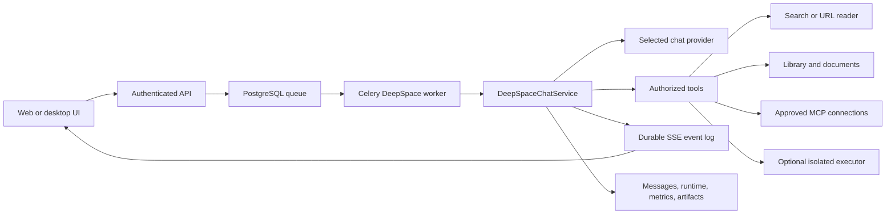

# AverQel end-to-end implementation and release handoff

**Status date:** 2026-09-18
**Scope:** backend, workers, frontend DeepSpace, database migrations, optional
capability services, tests, and operational documentation.

This is the release-status document for the current workspace. The numbered
capability documents describe individual features; this document records how
they connect, what is actually available, and what must be completed before a
GitHub push or deployment is called end-to-end complete.

## 1. End-to-end request path



The browser is a client, not the owner of a DeepSpace run. The API validates
the request, persists the queue record, and starts or resumes a worker. The
worker owns provider calls, tool authorization, runtime checkpoints, durable
events, message persistence, and terminal state. A browser refresh or dropped
SSE connection must reconnect to the same durable request id.

## 2. Current capability matrix

| Capability | Code exists | End-to-end status | Release note |
|---|---:|---|---|
| Normal DeepSpace chat | Yes | Available | Uses the authenticated API, provider selection, worker, SSE, and durable message history. |
| Clarification and approval resume | Yes | Available in worktree; needs release regression | Answers reuse the paused run and original request id. |
| Composer queue and steer | Yes | Available in worktree; needs migration and load validation | Queue records are tenant/user/conversation scoped. |
| Provider-aware reasoning and context limits | Yes | Available in worktree; needs provider matrix validation | Provider-specific request shaping must remain capability-aware. |
| Operational metrics and provider circuit | Yes | Available in worktree; needs migration and dashboard validation | Metrics must remain tenant-safe and must not contain prompts or secrets. |
| Library, document, OCR, dataset, and artifact workflows | Yes | Available | See documents 1, 2, 4, 8, 10, 11, and 13. |
| Web search | Yes | Available when a web provider is configured | Search returns normalized result metadata and snippets. |
| Static webpage text extraction | Yes | Partially wired | `url_read` and the safe URL reader exist, but normal research routing currently exposes `web_search` without reliably exposing `url_read`. |
| JavaScript webpage extraction | Yes | Not release-ready | The isolated renderer and egress profile exist, but the normal DeepSpace URL-read path still needs browser fallback wiring and an end-to-end test. |
| MCP connections | Yes | Available when connected and approved | Reads may run automatically; side effects require approval. |
| Sandboxed Python/SQL | Yes | Gated | Requires the isolated executor profile, token, and smoke tests. |
| Scheduled jobs | Yes | Available when scheduler and migrations are deployed | Beat and worker must be enabled only after migration validation. |

“Code exists” does not mean a feature is ready to advertise. A feature is
release-ready only when its route, worker path, authorization boundary,
frontend state, migration, tests, and deployment instructions agree.

## 3. Database changes in the current worktree

The current uncommitted work adds or updates durable runtime state. Apply and
verify migrations before starting workers that depend on these tables:

- `20260916_0001_deepspace_queued_turns.py`
- `20260916_0002_deepspace_request_metrics.py`
- `20260917_0001_cascade_deepspace_runtime_and_snapshots.py`
- `20260918_0001_deepspace_context_summaries.py`

The existing runtime, schedule, artifact, MCP, and Library migrations remain
part of the same ordered Alembic history. Never manually reorder migration
files or start a production worker against a database that has not been
migrated.

## 4. Webpage reading: required implementation

The intended research flow is:

```text
User asks for current research
  -> web_search finds candidate URLs
  -> url_read fetches a selected public page
  -> optional browser renderer handles JavaScript content
  -> bounded text is returned to the model
  -> citations identify fetched sources
```

The current code already contains:

- `WEB_SEARCH_TOOL` and the configured search-provider path;
- `URL_READ_TOOL` and `read_url()` with SSRF, redirect, size, and content-type
  checks;
- `browser_reader.py`, Chromium, and the `research-browser` Compose profile.

The remaining integration work is:

1. Add `URL_READ_TOOL` to the normal research tool set alongside
   `WEB_SEARCH_TOOL`.
2. Detect direct URL/open/read-page requests even when the prompt does not use
   the word “search”.
3. Let the URL-read dispatcher use the isolated renderer when static HTML is
   insufficient and the renderer is enabled.
4. Preserve public-URL validation, domain allowlists, response limits,
   timeouts, and no-cookie/no-login behavior.
5. Add a test that performs search, reads a public result, and verifies the
   citation source is `url_read`.

Until these steps are complete, documentation and UI must describe the feature
as “search with snippet fallback” rather than “the assistant can open every
webpage.”

## 5. Configuration and deployment order

1. Prepare PostgreSQL, Redis, MinIO, API, worker, and frontend configuration.
2. Configure a permitted chat provider and, separately, a web-search provider.
3. Run `alembic upgrade head` from the backend release image.
4. Start API and workers and verify `/api/v1/health/live` and
   `/api/v1/health/ready`.
5. Enable optional sandbox execution only with its isolated profile and token.
6. Enable `research-browser` only after Chromium, Squid, bearer authentication,
   SSRF blocking, and public-page smoke tests pass.
7. Run authenticated frontend and DeepSpace end-to-end tests in staging.
8. Review metrics, queue depth, failure rate, p50/p95 latency, and worker
   logs before production activation.

The default deployment must remain safe when optional browser and sandbox
profiles are disabled. A missing optional capability must produce a clear
unavailable result, never fabricated evidence or an unsafe fallback.

## 6. Verification commands

Run from `backend` with the project virtual environment:

```bash
source .venv/bin/activate
pytest -q tests/unit/test_deepspace_chat_service.py
pytest -q tests/unit/test_deepspace_runtime.py tests/unit/test_deepspace_run_events.py
pytest -q tests/unit/test_deepspace_tool_profiles.py tests/unit/test_provider_context_transport.py
pytest -q tests/unit tests/integration tests/security tests/e2e -n 4
```

Run the frontend checks from `frontend` using the repository package scripts:

```bash
npm test -- --run
npm run build
```

Run the URL/browser smoke checks only against staging or a disposable local
environment. Do not put provider credentials, tenant identifiers, prompts, or
private files in test output.

## 7. Release gate

Before committing or pushing:

- the working tree is reviewed and generated files are excluded;
- every new migration applies cleanly to a fresh database and upgrades an
  existing database;
- backend, frontend, and focused end-to-end tests pass;
- `url_read` behavior is either fully wired and tested or explicitly marked
  unavailable;
- browser and sandbox profiles are tested only when enabled;
- deleted files have confirmed replacements and no stale imports;
- docs match the actual tool routing and deployment state;
- commits are separated by logical feature or fix;
- the final diff and commit list are reviewed before `git push`.

The manual semantic-release workflow accepts an explicit canonical
`release_version` input. To publish the requested patch release after the PR
is merged to `main`, run it with `release_version=v1.2.20`; the workflow still
validates the `vMAJOR.MINOR.PATCH` format before tagging.

The current workspace has not yet cleared this full release gate.
