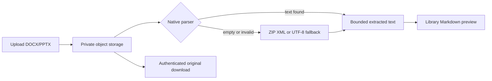

# 10. Library Office preview and extraction

## Purpose

Office files are not browser-renderable formats. AverQel therefore previews
their extracted, safe text in the Library instead of embedding a DOCX/PPTX
download in an iframe. The original bytes remain available through the
authenticated download route.

## Preview flow

## Supported recovery paths

1. `python-docx` and `python-pptx` extract normal paragraphs, tables, slide
   text, and notes.
2. A bounded Open XML fallback reads visible text from `word/*.xml` or
   `ppt/slides/*.xml` without writing archive entries to disk.
3. A payload that is readable UTF-8 text but has an Office filename is shown
   as text/Markdown. This handles files created with the wrong extension or
   MIME type without exposing binary data to the browser.
4. Empty image-only Office documents remain downloadable and clearly report
   that no text was available for an in-app preview.

## Safety limits

- XML entries are read in memory only, with 25 MiB per entry and 100 MiB total
  fallback limits.
- Parsed text is bounded by the configured parser character limit.
- No object-storage URL, local path, cookie, or credential is sent to the
  frontend.
- Every detail/content request enforces tenant, user, and conversation
  ownership.
- Office binaries are never embedded in an iframe; this prevents forced
  downloads and unsafe browser handling.

## Verification

1. Upload a valid DOCX with paragraphs and confirm the text appears in the
   preview without a download prompt.
2. Upload a valid PPTX and confirm slide text appears in the preview.
3. Upload a readable text payload named `.docx` and confirm the fallback text
   appears.
4. Upload an image-only Office document and confirm a clear empty-preview
   message plus an authenticated download option.
5. Confirm a Unicode filename (for example `NOESIS-Σ - Training Weight.docx`)
   returns HTTP 200 from `/api/v1/deepspace/library/{conversation_id}/files/{file_id}/content`.
