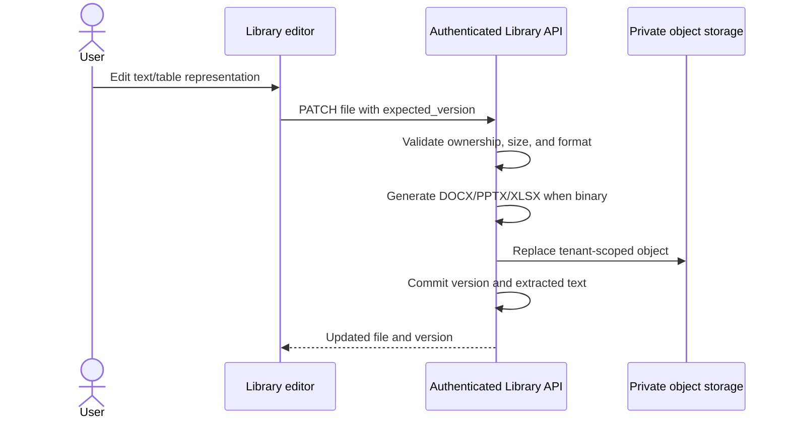

# 11. Library editing, image controls, and exports

## User capabilities

1. Markdown, text, CSV, and code files remain editable in CodeMirror.
2. Extracted DOCX, PPTX, and XLSX content can be edited and saved. AverQel
   regenerates a valid Office file, keeps the same Library file identity, and
   records a new version.
3. Images have in-app zoom-out, zoom-in, and reset controls. The original
   image bytes are never modified.
4. The selected file's Export menu supports the original format, Markdown,
   TXT, PDF, DOCX, PPTX, and XLSX where a compatible text/table representation
   exists.
5. Every export is private, tenant-scoped, authenticated, and sent with a
   safe Unicode filename.

## Save flow

## Safety and compatibility

- PDF, images, audio, video, and archives remain preview/download oriented;
  their binary formats are not silently rewritten.
- Office regeneration is bounded by the configured upload and text limits.
- Optimistic `expected_version` prevents overwriting another user's edit.
- Failed database commits attempt to restore the previous Office payload.
- Export HTML escapes user content before PDF generation.
- Browser object URLs are revoked by the Library lifecycle.
