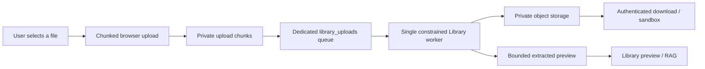

# 13. Large Library imports and safe data previews

## Purpose

This feature lets users import supported files up to the configured 25 MiB
limit without allowing a large CSV, TSV, JSON, spreadsheet, or document to
block DeepSpace chat, the API, or the browser interface.

## What happens

1. The browser uploads in 2 MiB resumable chunks.
2. Files larger than 2 MiB upload one at a time from a browser tab. Small
   batches retain limited parallel upload behavior.
3. Finalization runs in the `library_uploads` Celery queue, not the
   interactive `deepspace` chat queue.
4. The `library-worker` has concurrency one, one CPU, and a 768 MiB memory
   limit. A malformed or expensive import cannot consume API or chat-worker
   capacity.
5. Text data over 512 KiB is retained as a private object rather than copied
   into PostgreSQL and browser editor state. The original can still be
   downloaded or used by the authorized sandbox.
6. CSV previews show at most 200 rows, 50 columns, and 512 KiB of text.
   This prevents a million-row file from creating millions of browser DOM
   elements. The interface clearly labels such a view as a safe preview.

## User experience

- A 4–25 MiB CSV shows normal upload and processing status while the rest of
  AverQel remains usable.
- The Library displays a compact first-page table, rather than trying to
  render the complete dataset.
- Large files are read-only in the in-browser editor. Use **Download** for
  the original file or ask DeepSpace to analyze the authorized file through
  the sandbox.
- Small text and CSV files remain directly editable as before.

## Security and limits

1. Existing authentication, tenant, user, conversation, and folder ownership
   checks run before every upload, status read, preview, download, and
   sandbox hand-off.
2. File size remains capped by `AKS_UPLOAD_MAX_BYTES` (25 MiB by default).
3. Data stays in tenant-scoped private object storage; no storage URL is sent
   to the browser.
4. Extraction of large CSV/TSV/JSON inputs is bounded to a completed record
   near the 512 KiB limit. This is enough for preview/RAG context while the
   complete source remains available to the sandbox.
5. Upload chunks are deleted after completion, cancellation, or failure.

## Verification

1. Upload a 9 MiB CSV and a 4 MiB CSV. They should be processed serially and
   show `processing`, then `complete`, without freezing the DeepSpace tab.
2. Open the large CSV. Confirm that the banner says it is a safe preview and
   no more than 200 rows are rendered.
3. Download the same file and verify its checksum/size matches the original.
4. Ask: `Analyze the uploaded CSV and calculate the average of column X.`
   The sandbox should access the authorized original file, not the preview.
5. In another browser session or tenant, request the file ID. It must return
   `404` rather than exposing data.
