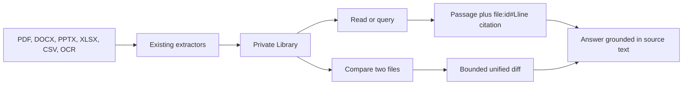

# 02. Rich document intelligence audit

## 1. What it does

1. Reads extracted PDF, DOCX, PPTX, XLSX, CSV, OCR, and text content.
2. Compares two authorized documents with a bounded unified diff.
3. Searches extracted text and returns stable line-level citations.
4. Uses the shared embedding and reranking services for indexed document
   retrieval. Workspace Library files that have not entered the document
   chunk index use deterministic lexical matching plus the configured
   reranker, with a safe lexical fallback when no reranker is available.

| Public use case | What the user gets | Evidence shown |
| --- | --- | --- |
| Ask a question about an uploaded report | A concise answer from extracted text | File and line citation |
| Compare two contract or policy versions | Added and removed passages | Both authorized file IDs |
| Find every mention of a term | Matching passages | Stable `file:{id}#L{line}` references |

## 2. Existing foundation

1. Extractors: `backend/app/ingestion/services/extractors/`.
2. Upload and document APIs: `backend/app/documents/api/`.
3. DeepSpace Library storage and previews: `backend/app/deepspace/api/library.py`
   and `frontend/app/dashboard/deepspace/_components/`.

## 3. Exact implementation

1. Assistant tools `document_read`, `document_compare`, and `document_query`
   live in `backend/app/deepspace/services/chat_service.py`.
2. Direct search API: `POST /api/v1/deepspace/documents/query` in
   `backend/app/deepspace/api/documents.py`.
3. Every operation uses `DeepSpaceTaskLoopStore` and the existing conversation,
   user, and tenant ownership checks.
4. Retrieval integration is implemented in
   `backend/app/query/services/retrieval_service.py` and
   `backend/app/query/services/reranker_service.py`; DeepSpace workspace
   matching is assembled in `chat_service.py` without bypassing ownership.

## 4. Execution flow

1. A request identifies a conversation and optionally a Library file.
2. AverQel reads only files owned by that authenticated user in that
   conversation.
3. Text is bounded before returning it to the model or browser.
4. Matching passages include `file:{id}#L{line}` citations.

## 5. What users see

1. The assistant can quote relevant document passages instead of inventing
   content from filenames or snippets.
2. Compare results show additions/removals between two selected documents.
3. Citations identify the exact Library file and line location.

## 6. Security and correctness

1. Cross-user and cross-tenant reads are rejected by the existing store.
2. Binary files use extracted text and never expose storage credentials.
3. Response limits prevent oversized document content from destabilizing a
   chat or browser.
4. OCR confidence and extraction warnings remain attached to the stored
   ingestion result; DeepSpace reuses that result rather than performing a
   slower duplicate OCR pass during every answer.

## 7. Verification and production state

1. Tool schemas, DeepSpace regression tests, route registration, and type
   checks passed.
2. The extractor and Library systems remain unchanged for existing workflows.
3. Semantic summarization remains model synthesis over these cited passages;
   the backend does not fabricate a claim when no passage is returned.
