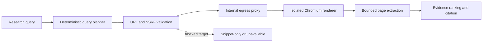

# 03. Controlled browser research audit

## 1. What it does

1. Renders public JavaScript pages that the secure text reader cannot parse.
2. Supports research retrieval only; it is not an unrestricted browser.
3. Prevents cookies, credentials, downloads, private-network access, and
   side-effecting interactions.

| Public use case | What the user gets | What is deliberately blocked |
| --- | --- | --- |
| Research a JavaScript-heavy public page | Rendered, readable page evidence | Cookies, logins, downloads, private networks |
| Verify a current claim | Fetched passage with source status | Treating a search snippet as a fetched page |
| Open an unsafe or unavailable URL | Clear blocked/unavailable status | Silent access or fabricated evidence |

## 2. Exact implementation

1. Adapter: `backend/app/deepspace/services/browser_reader.py`.
2. Renderer: `backend/research-renderer/server.mjs`.
3. Egress policy: `backend/research-renderer/squid.conf`.
4. Deployment profile: `research-browser` in
   `backend/docker-compose.prod.yml`.
5. Static public-page extraction: `backend/app/deepspace/services/url_reader.py`
   and the `url_read` dispatcher in `chat_service.py`.
6. Research orchestration and snippet-only fallback: DeepSpace's native
   `web_search` path.

## 3. Execution flow

1. Research intent selects deterministic query planning.
2. `web_search` returns candidate URLs and snippets.
3. A complete implementation calls `url_read` for a selected public URL.
4. The secure URL validator checks the target before static fetching or
   rendering.
5. When enabled and wired, Chromium runs behind Squid on an internal network.
6. Every browser request is checked again; blocked requests are aborted.
7. Extracted HTML is bounded and returned to evidence ranking.
8. If reading or rendering fails, the source is labeled unavailable or
   snippet-only; snippets are never presented as fetched page text.

## 4. What users see

1. Once the renderer is enabled and the URL-read fallback is wired, pages
   requiring JavaScript can contribute fetched evidence.
2. Sources that cannot be opened are visibly distinguished from verified
   fetched pages.
3. Research progress and citations continue through the normal DeepSpace SSE.

## 5. Security audit

1. SSRF checks reject private, link-local, loopback, and service hostnames.
2. Squid is the only browser egress path and has internal-destination ACLs.
3. Renderer requests require a strong bearer token and strict timeouts.
4. No user-approved side-effecting automation is exposed by this profile.

## 6. Verification and production state

1. The renderer and egress proxy are health-checked when the
   `research-browser` Compose profile is deployed.
2. The default local Compose deployment does not start that optional profile;
   the API therefore reports browser rendering as unavailable until the profile
   is deployed on the same internal network.
3. Operators must smoke-test the profile in their target environment before
   enabling it; the profile is deliberately separate from normal API traffic.

### Current implementation gap

The URL reader and isolated browser adapter exist, but the normal DeepSpace
research tool list currently adds `web_search` without consistently adding
`url_read`, and `browser_reader.py` is not yet the automatic fallback for a
JavaScript-heavy URL. The capability is therefore **partially implemented**.
Do not mark search-to-page extraction complete until the routing, fallback, and
authenticated citation test described in `00-end-to-end-handoff.md` pass.
