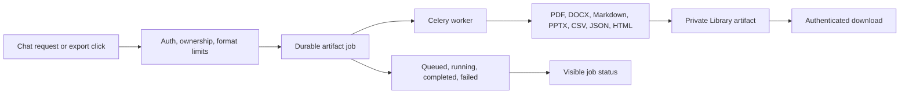

# 04. Artifact generation and export audit

## 1. What it does

1. Creates structured Markdown, CSV, JSON, HTML, text, SVG, Mermaid, and UML
   artifacts, with explicit document/table/chart/diagram/data/code kinds.
2. Persists queued artifact jobs and materializes them through the private
   DeepSpace Library.
3. Exports notes as PDF, DOCX, Markdown, and editable PPTX.
4. Retains authenticated private media-artifact delivery.
5. Automatically places sandbox-generated files and `artifact_create` results
   in the DeepSpace Artifact panel for authenticated preview/download.

| Public use case | What the user gets | Delivery guarantee |
| --- | --- | --- |
| Turn a conversation into a report | PDF, DOCX, Markdown, or PPTX | Durable job ID and status |
| Save structured data | CSV, JSON, HTML, or text artifact | Private Library ownership |
| Create a chart or diagram | SVG/PNG/chart output with a dedicated Artifact-panel card | Bounded private artifact delivery |
| Create UML or Mermaid | `.uml`/`.mmd` source plus safe text preview | No HTML injection; authenticated download |
| Export a large document | Background completion instead of a frozen page | Authenticated download only |

## 2. Exact implementation

1. Assistant tool: `artifact_create` in
   `backend/app/deepspace/services/chat_service.py`.
2. Job model: `backend/app/deepspace/models/artifact_job.py`.
3. Job API: `POST/GET /api/v1/deepspace/artifacts/jobs` in
   `backend/app/deepspace/api/artifacts.py`.
4. Worker: `create_artifact_task` in
   `backend/app/deepspace/workers/tasks.py`.
5. Export service: `backend/app/deepspace/integrations/export_service.py`.
6. Export API: `GET /api/v1/deepspace/export/{conversation_id}?format=...`.
7. Frontend export controls: `DeepSpaceEditor.tsx` and Library components.
8. Artifact panel: `frontend/app/dashboard/deepspace/_components/DeepSpaceMediaArtifacts.tsx`.

## 3. Execution flow

1. A job is created with an authenticated conversation owner.
2. The job is queued and visible by its durable id/status.
3. Celery writes the result through the existing tenant-scoped Library store.
4. Provider and sandbox outputs are persisted in object storage, while only
   bounded artifact metadata is sent through the model context.
5. Users download only through authenticated Library/export/artifact routes.

## 4. What users see

1. Reports and tables can be saved for later editing and download.
2. Notes can be exported to PDF, DOCX, Markdown, or PPTX from the editor.
3. Failed jobs expose an error status without exposing storage internals.

## 5. Security and correctness

1. Conversation ownership is checked before job creation.
2. Artifact content and filenames are bounded by API validation and Library
   filename policy.
3. Private media remains object-storage-backed and range-safe.

## 6. Verification and production state

1. Artifact job routes and worker imports pass backend checks.
2. PPTX generation was tested as a valid OpenXML package (`PK` signature).
3. Existing PDF, DOCX, Markdown, XLSX, and media workflows remain intact.
