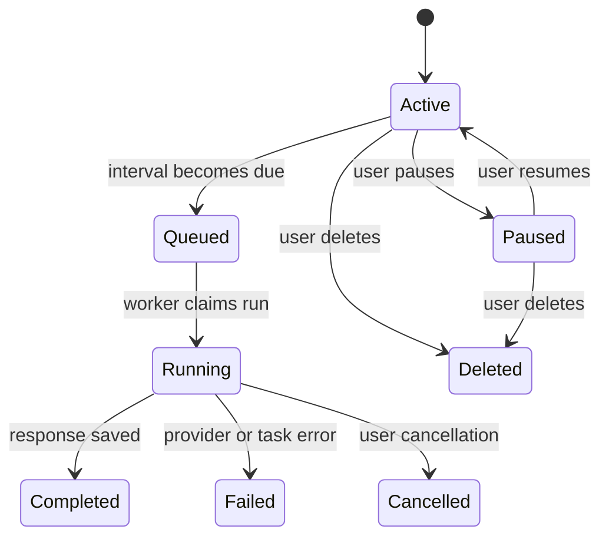

# 05. Scheduled and long-running jobs audit

## 1. What it does

1. Runs a user-owned DeepSpace prompt at a recurring interval.
2. Supports active/paused/deleted schedules.
3. Shows durable queued, running, completed, failed, and cancelled history.
4. Reuses normal DeepSpace execution, SSE recovery, cancellation, provider
   selection, and audit behavior.

| Public use case | What the user gets | Control available |
| --- | --- | --- |
| Refresh a research question every morning | A new DeepSpace run on schedule | Pause, resume, or delete |
| Monitor a recurring analysis | Durable run history and next-run time | Inspect each run status |
| Recover after a worker restart | Queued/running state recorded in the database | Retry or cancel through normal policy |

## 2. Exact implementation

1. Schedule model: `backend/app/deepspace/models/schedule.py`.
2. Run model: `backend/app/deepspace/models/schedule_run.py`.
3. APIs: `backend/app/deepspace/api/schedules.py`.
4. UI: `frontend/app/dashboard/deepspace/_components/DeepSpaceSchedulesPanel.tsx`.
5. Dispatcher: `backend/app/deepspace/workers/schedules.py`.
6. Beat registration: `backend/app/platform/worker/celery_app.py`.
7. Migrations: `20260913_0001`, `20260913_0002`, and `20260913_0003`.

## 3. Execution flow

1. The authenticated user creates a schedule tied to an owned DeepSpace
   conversation.
2. Celery Beat polls due rows every minute and claims them with `SKIP LOCKED`.
3. The dispatcher advances the next run before enqueueing to prevent duplicate
   dispatch.
4. The normal `deepspace.run` task records run status and streams its result.

## 4. What users see

1. A Schedules panel allows creation, pause/resume, and deletion.
2. Each schedule displays its next run and durable run history through the API.
3. A failure is visible as a failed run rather than silently disappearing.

## 5. Security and operations

1. Every schedule and run is scoped by tenant and user.
2. Intervals are bounded from five minutes through thirty days.
3. Prompts execute with the normal `queries:run` permission and provider policy.
4. The scheduler does not send unsolicited external notifications; existing
   SSE and connector approval policies remain authoritative.

## 6. Verification and production state

1. Model registration, migration head, route registration, worker imports,
   tests, Ruff, and mypy passed.
2. The migration applies on the new API image startup; the currently running
   old deployment must be rebuilt before the table exists.
