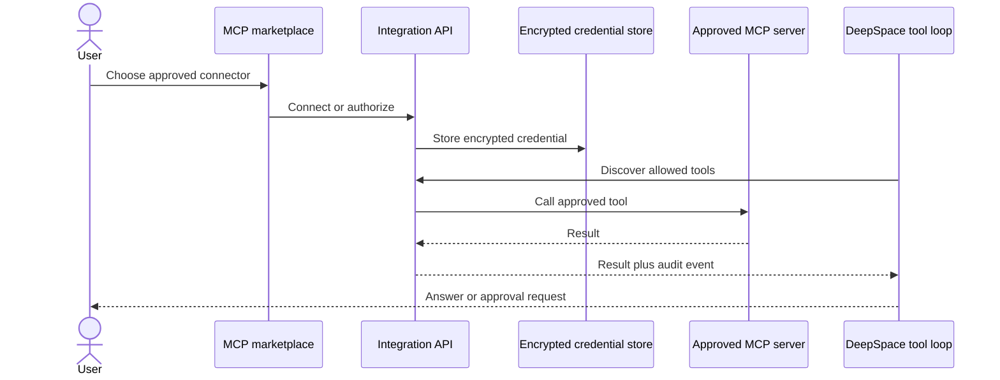

# 06. MCP connections audit

## 1. What it does

1. Discovers approved MCP servers and tools.
2. Connects through OAuth or supported transports.
3. Encrypts credentials and enforces tenant/user ownership.
4. Requires policy and approval controls before side-effecting actions.
5. Merges connected tools into the provider-independent DeepSpace loop.

| Public use case | What the user gets | Required protection |
| --- | --- | --- |
| Connect a supported service | Discoverable tools in DeepSpace | OAuth or encrypted credentials |
| Ask DeepSpace to read connected data | Provider-independent tool result | Tenant and user ownership checks |
| Ask for a side-effecting action | Approval prompt before execution | Policy gate and audit event |

## 2. Existing exact implementation

1. API and marketplace: `backend/app/integrations/api/mcp.py`.
2. Bridge/runtime: `backend/app/deepspace/services/mcp_bridge.py`.
3. Encrypted credentials and OAuth: `backend/app/integrations/services/` and
   `backend/app/integrations/models/`.
4. Frontend connection and policy UI: `frontend/app/dashboard/mcp/`.
5. Catalog refresh workers: `backend/app/integrations/workers/tasks_mcp*.py`.

## 3. Execution flow

1. Users choose an approved catalog entry.
2. OAuth or credentials are stored through the encrypted integration service.
3. Tool discovery is filtered by connection and policy.
4. DeepSpace requests approval before an action requiring it.
5. The bridge records the result and audit event.

## 4. What users see

1. Approved connectors appear in the MCP marketplace.
2. Users can inspect tools, change policy, connect, refresh, or disconnect.
3. Side-effecting calls display an approval prompt before execution.

## 5. Security and production state

1. Arbitrary remote servers are rejected; only approved catalog entries can be
   connected.
2. Tenant/user ownership checks protect servers, tools, and tokens.
3. No new connector is invented without a requested service and verified
   catalog metadata.
4. The MCP foundation is production-grade and provider-independent; expanding
   the catalog is an operational/product choice, not a missing runtime path.

## 6. Verification

1. Existing MCP connection, policy, OAuth, marketplace, and tool-loop tests
   remain part of the full regression suite.
2. The six-capability implementation does not weaken or bypass those controls.
