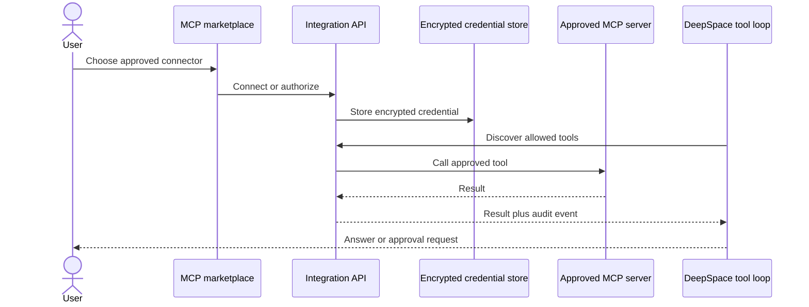

# 06. MCP connections audit

## 1. What it does

1. Discovers approved MCP servers and tools.
2. Connects through OAuth or supported transports.
3. Encrypts credentials and enforces tenant/user ownership.
4. Requires policy and approval controls before side-effecting actions.
5. Merges connected tools into the provider-independent DeepSpace loop.



| Public use case | What the user gets | Required protection |
| --- | --- | --- |
| Connect a supported service | Discoverable tools in DeepSpace | OAuth or encrypted credentials |
| Ask DeepSpace to read connected data | Provider-independent tool result | Tenant and user ownership checks |
| Ask for a side-effecting action | Approval prompt before execution | Policy gate and audit event |

## 2. Existing exact implementation

1. API and marketplace: `backend/app/integrations/api/mcp.py`.
2. Bridge/runtime: `backend/app/deepspace/services/mcp_bridge.py`.
3. Encrypted credentials and OAuth: `backend/app/integrations/services/` and
   `backend/app/integrations/models/`.
4. Frontend connection and policy UI: `frontend/app/dashboard/mcp/`.
5. Catalog refresh workers: `backend/app/integrations/workers/tasks_mcp*.py`.

## 3. Execution flow

1. Users choose an approved catalog entry.
2. OAuth or credentials are stored through the encrypted integration service.
3. Tool discovery is filtered by connection and policy.
4. DeepSpace requests approval before an action requiring it.
5. The bridge records the result and audit event.

## 4.1 DeepSpace catalogue protection

The MCP connection layer and the DeepSpace model boundary are intentionally
separate. `DeepSpaceMCPBridge` discovers only tenant/user-owned, enabled,
connected, policy-enabled servers. The DeepSpace broker then keeps those
catalogue entries backend-only and gives the selected model a small deferred
interface:

```text
DeepSpace model
    │ mcp_search_tools(query)
    ▼
Private broker index ──► compact tool_ref matches
    │ mcp_get_tool_schema(tool_ref)
    ▼
One bounded schema hint
    │ mcp_call_tool(tool_ref, arguments)
    ▼
Existing MCP bridge ──► policy/approval/catalog revision/transport/audit
```

Only the minimum metadata for the current request crosses the model boundary.
The broker never forwards all server tools, all JSON schemas, OAuth material,
or transport configuration. A result larger than the configured MCP result
budget is returned as a bounded preview with an explicit truncation marker.

This design applies to all connected MCP apps and future catalog entries. It
does not add a second OAuth client, connection store, remote proxy, or
authorization system. The existing connection-scope APIs remain unchanged:

- `GET /api/v1/mcp/conversations/{conversation_id}/connections`
- `PUT /api/v1/mcp/conversations/{conversation_id}/connections/{server_id}`
- `POST /api/v1/deepspace/chats/{conversation_id}/approvals/{approval_id}`

The implementation is covered by
`backend/tests/unit/test_mcp_tool_broker.py`, the existing bridge tests, and
the DeepSpace chat-loop tests. Broker exposure is mandatory; there is no
legacy full-catalogue fallback. Per-turn discovery, remote-call, and aggregate
result budgets are emitted in DeepSpace metrics for operational monitoring.

## 4. What users see

1. Approved connectors appear in the MCP marketplace.
2. Users can inspect tools, change policy, connect, refresh, or disconnect.
3. Side-effecting calls display an approval prompt before execution.

## 5. Security and production state

1. Arbitrary remote servers are rejected; only approved catalog entries can be
   connected.
2. Tenant/user ownership checks protect servers, tools, and tokens.
3. No new connector is invented without a requested service and verified
   catalog metadata.
4. The MCP foundation is production-grade and provider-independent; expanding
   the catalog is an operational/product choice, not a missing runtime path.

## 6. Verification

1. Existing MCP connection, policy, OAuth, marketplace, and tool-loop tests
   remain part of the full regression suite.
2. The six-capability implementation does not weaken or bypass those controls.
