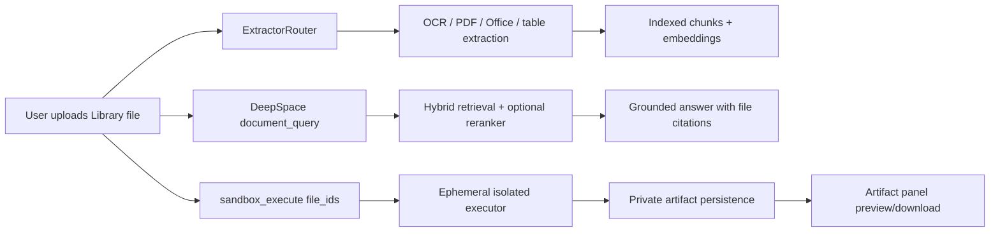

# 08. OCR, Library-to-sandbox, RAG, and artifact output

## 1. Purpose

1. Reuse the existing ingestion extractors and OCR before any sandbox work.
2. Let DeepSpace pass only user-owned Library files to the isolated executor.
3. Use existing embeddings and reranking for the document/RAG pipeline, while
   keeping workspace-file fallback search deterministic when no indexed
   document exists.
4. Collect generated charts, tables, diagrams, UML, documents, and data files
   in the private DeepSpace artifact panel.

## 2. What already exists

1. `ExtractorRouter` supports PDF, DOCX, PPTX, XLSX, CSV, images/OCR, text,
   and safe legacy-office conversion.
2. OCR is performed by `OcrService` through `ImageOcrExtractor`; extracted
   text is stored with the Library file and reused by document tools.
3. The indexed document path already uses `EmbeddingService` and
   `RerankerService` in `RetrievalService`.
4. DeepSpace has tenant-scoped Library records and authenticated object
   storage, so a model never supplies a filesystem path or storage key.

## 3. New behavior

1. `sandbox_execute` accepts at most five authorized `file_ids`.
2. The API verifies tenant, user, and conversation ownership before reading
   bytes from object storage.
3. Existing extracted/OCR text is supplied as a sidecar file so Python can
   use reliable text without re-running OCR.
4. Raw bytes are staged only inside the executor's request-scoped temporary
   directory. The directory is removed in `TemporaryDirectory` cleanup.
5. Python can read the staged filename; SQL continues to operate only on
   supplied in-memory tables.
6. Newly created chart/data/document files are returned within strict output
   limits and persisted as private artifacts.
7. `artifact_create` supports Markdown, CSV, JSON, HTML, text, SVG, Mermaid,
   and UML, with explicit artifact kinds (`document`, `table`, `chart`,
   `diagram`, `data`, and `code`).

## 4. User-visible routes and tools

| Capability | Route/tool | Result |
| --- | --- | --- |
| Execute with Library files | `sandbox_execute(file_ids=[...])` or `POST /api/v1/deepspace/sandbox/execute` | Bounded result and generated artifacts |
| Read extracted document | `document_read` | OCR/text plus file metadata and citation |
| Search documents | `document_query` | Ranked passages and `file:{id}#L{line}` citations |
| Create an artifact | `artifact_create` | Library file plus Artifact-panel card |
| Download/preview artifact | `GET /api/v1/deepspace/artifacts/{id}/content` | Authenticated private bytes |

## 5. Limits and cleanup

1. Maximum five input files per execution.
2. Maximum 10 MB per input and 20 MB aggregate at the API boundary.
3. Maximum 30 seconds execution time, bounded stdout/stderr, and bounded
   generated files.
4. Maximum ten generated files and 1.5 MB aggregate output from the executor.
5. Input and generated temporary data are deleted when the request exits,
   including failures and timeouts.
6. Unsupported MIME types, invalid base64, path traversal, unsafe imports,
   and mutating SQL are rejected.

## 6. Security invariants

1. File IDs are resolved through tenant/user/conversation predicates before
   object storage access.
2. No host mounts, public executor port, credentials, cookies, or arbitrary
   URLs are available to sandbox code.
3. Artifacts are stored under the owning tenant and delivered only after the
   existing authenticated ownership check.
4. HTML/SVG artifacts receive a restrictive Content Security Policy and are
   never injected into the React DOM as HTML.
5. Existing auth, RLS, encrypted storage, MCP approvals, schedules, and media
   generation behavior are unchanged.

## 7. Verification checklist

1. Unit-test file authorization, invalid IDs, aggregate-size limits, cleanup,
   unsafe imports, and read-only SQL.
2. Exercise a CSV/JSON calculation and a Python chart that produces PNG/SVG.
3. Upload an OCR image/PDF and verify `document_read` returns extracted text.
4. Verify `document_query` returns stable file citations and retrieval metadata.
5. Verify an `artifact_create` call appears in the panel and downloads only
   with an authenticated session.
6. Run backend and frontend regression suites before enabling the production
   sandbox profile.
