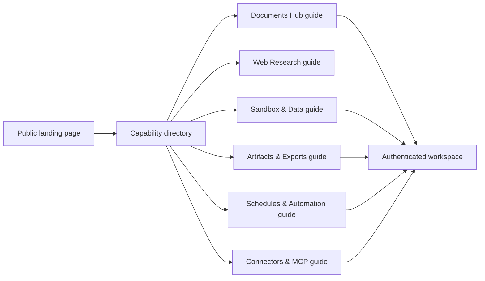

# 9. Public Landing Page and Capability Directory

## 1. Purpose

The public landing page is a compact product entry point. It names the capabilities that exist in
the current AverQel build and links each one to an internal guide with workflow, limits, and setup
requirements. Detailed marketing sections remain available behind an explicit disclosure instead of
making the first page excessively long.

## 2. What is shown

1. DeepSpace workspace, notes, memory, and collections.
2. Library and document intelligence.
3. Evidence-first web research.
4. Sandboxed Python and read-only SQL analysis.
5. Private artifacts and exports.
6. Schedules and long-running work.
7. Providers and approved MCP connections.

Each card has a status label. Optional deployment dependencies are stated as setup requirements;
the page does not imply that a disabled local service is currently running.

## 3. User navigation

## 4. Frontend files

1. `frontend/app/page.tsx` renders the compact directory and keeps the detailed product story in a
   closed-by-default disclosure.
2. `frontend/app/components/marketing/CapabilityDirectory.tsx` owns capability cards, status
   labels, icons, and internal documentation links.
3. `frontend/app/components/marketing/HeroSection.tsx` and `MobileNav.tsx` route navigation to the
   directory and real documentation pages.
4. `frontend/app/components/layout/Footer.tsx` uses the same documentation destinations.
5. `frontend/app/documentation/_components/docsNav.tsx` exposes the new guides in desktop and mobile
   documentation navigation.
6. `frontend/app/documentation/library/page.tsx`, `sandbox/page.tsx`, `artifacts/page.tsx`, and
   `automation/page.tsx` document the capability contracts with numbered workflows and diagrams.

## 5. Truthfulness and release state

1. “Available” means the route and backend capability are implemented; deployment-specific providers,
   workers, credentials, and permissions can still affect availability.
2. “Enable sandbox profile” means the API must be configured to reach the isolated executor.
3. “Renderer optional” means standard text research works without the JavaScript renderer; the
   renderer requires its own isolated deployment and egress policy.
4. “Worker + Beat required” means schedule creation is separate from automatic dispatch; Celery
   worker and Beat services must be running for recurring execution.
5. Approved MCP connectors are discoverable through the existing marketplace and policy system; the
   landing page does not invent or promise arbitrary integrations.

## 6. What must not change

1. Existing landing sections, animations, auth links, downloads, and security links remain available
   when the detail disclosure is opened.
2. Backend routes, tenant isolation, encrypted credentials, provider routing, Library ownership, and
   worker workflows are not bypassed by public navigation.
3. No secret, token, internal hostname, or private API route is embedded in the landing page.
4. Documentation links must resolve to real routes; claims must be updated when deployment status
   changes.

## 7. Verification

1. `pnpm --dir frontend exec eslint` passes for the changed components and documentation pages.
2. `pnpm --dir frontend exec tsc --noEmit` passes.
3. The focused landing/documentation tests cover all seven cards, honest optional-service statuses, and
   existing hero/documentation rendering.
4. The full frontend suite remains the release gate; warnings from existing asynchronous UI tests do
   not fail the run.

## 8. Notification polling note

The dashboard notification center polls the authenticated endpoint every 15 seconds. It prevents
overlapping requests and uses a 10-second request budget, so a transient browser or network stall
cannot keep a request pending for the full global 30-second API timeout. The backend endpoint remains
tenant-scoped and indexed; a timeout should still be investigated with the browser Network panel and
API logs rather than treated as a successful response.
