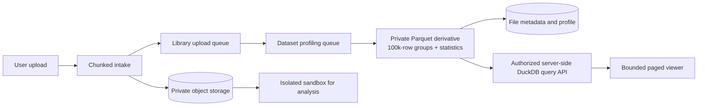

# Heavy-file processing architecture

## 1. Purpose

This document defines how AverQel handles large and dense files without
blocking chat, authentication, the API, or the browser. The browser is a
bounded presentation surface; the original file remains private in object
storage and heavy work runs in isolated workers.

## 2. Processing flow

## 3. Queue isolation

1. `library_uploads` assembles chunks and creates the private Library record.
2. `dataset_indexing` converts CSV, TSV, JSON, and XLSX into tenant-private,
   Zstandard-compressed Parquet away from API and chat workers. Parquet is
   written with 100,000-row groups and statistics so DuckDB can use durable
   columnar indexes and predicate pushdown.
3. Additional format workers must use dedicated queues as they are added:
   document/OCR, media preview, archive inspection, and artifact export.
4. Worker concurrency, memory, CPU, retry, and time limits are independent.
5. A large file may be queued or show `processing`; that is a controlled state,
   not an API timeout or browser freeze.

## 4. Browser contract

1. The browser never receives the original multi-megabyte file to build a full
   table.
2. CSV/TSV preview renders one bounded page (200 rows and 50 columns).
3. Previous/Next requests replace the current page; rows are not accumulated
   in React state or the DOM.
4. The page endpoint remains authenticated and checks tenant, user, workspace,
   and file ownership.
5. The original file remains available through the authenticated download and
   sandbox authorization paths.

## 5. Dataset profile and server-side query contract

The `dataset_profile` metadata records processing status, source format, row
count, column count, permitted column names, Parquet object reference, and row
group size. It is produced by the `deepspace.library_dataset_profile` task and
is intentionally bounded. It is not a replacement for the original data and
must not contain credentials or unbounded content.

Authenticated, ownership-checked APIs are:

1. `GET /api/v1/deepspace/library/{conversation_id}/files/{file_id}/csv-page`
   remains compatible with the existing UI and transparently reads Parquet
   once ready.
2. `POST .../dataset-query` provides bounded column selection, offset paging,
   sorting, and up to ten parameterized allowlisted filters.
3. `POST .../dataset-aggregate` provides `count`, `sum`, `avg`, `min`, and
   `max`, optionally grouped by an allowed column. It is the safe source for
   charts and summary tables.
4. `POST .../dataset-chart` persists aggregate results as a tenant-scoped
   chart-data JSON artifact in the DeepSpace Library. The existing artifact
   panel can preview, download, and export it without returning source rows to
   the browser.

No endpoint accepts SQL, a storage key, URL, filesystem path, or unvalidated
column name. The API uses a short-lived local Parquet copy and deletes it in a
`finally` block; all durable content stays in tenant-private object storage.

## 6. Delivery status and deliberately separate work

Delivered now: worker-isolated columnar derivatives; durable Parquet row-group
statistics; DuckDB server-side paging, filtering, sorting, and aggregation;
and the existing bounded Library page viewer.

Still deliberately separate from this change: multi-dataset joins and
user-defined SQL notebooks. They require explicit tenant-scoped product
contracts and authenticated browser E2E coverage; they must not be silently
introduced through a generic query endpoint. The Library viewer now uses a
fixed-height virtualized grid over server-paged results, so offscreen rows are
not mounted in the browser DOM.

PDF, Office documents, archives, images, audio, and video continue through the
existing extraction/OCR, archive inspection, media-preview, and artifact paths.
They are not falsely converted into tabular Parquet. Their heavy processing
must remain on dedicated format queues as described above.

## 7. Safety invariants

1. Never put the original payload in PostgreSQL text, prompt context, or the
   browser DOM.
2. Never let dataset work share the interactive DeepSpace queue.
3. Enforce file ownership on every page, query, download, and sandbox request.
4. Keep originals immutable; transformations create a new version or artifact.
5. Apply antivirus, archive-bomb, parser, quota, timeout, and cleanup policies.
6. Expose progress and actionable failure states to users.

## 8. Verification

1. Upload a dense CSV and confirm the UI remains responsive while the worker
   reports processing.
2. Confirm the profile becomes ready without changing the original checksum.
3. Navigate pages and verify only one bounded page is rendered at a time.
4. Saturate the indexing queue and confirm chat/API health checks remain fast.
5. Attempt a cross-tenant file ID and confirm an authorization denial.
6. Test cancellation, retry, malformed CSV, and worker restart recovery.
7. Run the derivative unit tests: `pytest -q tests/unit/test_dataset_derivatives.py`.
8. Verify unknown columns, filters, and aggregation expressions return the
   canonical 422 error response and never reach SQL execution.
