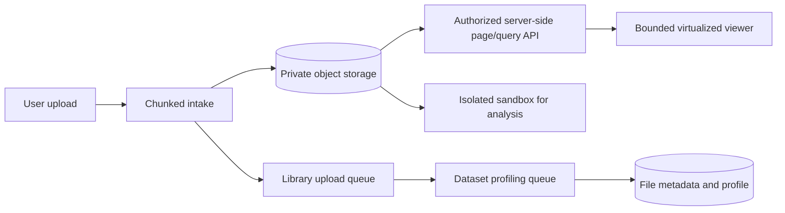

# Heavy-file processing architecture

## 1. Purpose

This document defines how AverQel handles large and dense files without
blocking chat, authentication, the API, or the browser. The browser is a
bounded presentation surface; the original file remains private in object
storage and heavy work runs in isolated workers.

## 2. Processing flow

## 3. Queue isolation

1. `library_uploads` assembles chunks and creates the private Library record.
2. `dataset_indexing` profiles CSV/TSV datasets away from the API and chat
   workers.
3. Additional format workers must use dedicated queues as they are added:
   document/OCR, media preview, archive inspection, and artifact export.
4. Worker concurrency, memory, CPU, retry, and time limits are independent.
5. A large file may be queued or show `processing`; that is a controlled state,
   not an API timeout or browser freeze.

## 4. Browser contract

1. The browser never receives the original multi-megabyte file to build a full
   table.
2. CSV/TSV preview renders one bounded page (200 rows and 50 columns).
3. Previous/Next requests replace the current page; rows are not accumulated
   in React state or the DOM.
4. The page endpoint remains authenticated and checks tenant, user, workspace,
   and file ownership.
5. The original file remains available through the authenticated download and
   sandbox authorization paths.

## 5. Dataset profile

The `dataset_profile` metadata records processing status, format, row count,
column count, column names, and a small sample. It is produced by the
`deepspace.library_dataset_profile` task and is intentionally bounded. It is
not a replacement for the original data and must not contain credentials or
unbounded content.

## 6. Enterprise next stage

For very large or repeatedly queried data, the profile worker must be extended
to create a private columnar derivative (for example Parquet) and a row/byte
cursor index. The API can then use keyset/cursor pagination and DuckDB/Polars
server-side filtering, sorting, joins, aggregations, and chart queries without
rescanning the original object for every page.

## 7. Safety invariants

1. Never put the original payload in PostgreSQL text, prompt context, or the
   browser DOM.
2. Never let dataset work share the interactive DeepSpace queue.
3. Enforce file ownership on every page, query, download, and sandbox request.
4. Keep originals immutable; transformations create a new version or artifact.
5. Apply antivirus, archive-bomb, parser, quota, timeout, and cleanup policies.
6. Expose progress and actionable failure states to users.

## 8. Verification

1. Upload a dense CSV and confirm the UI remains responsive while the worker
   reports processing.
2. Confirm the profile becomes ready without changing the original checksum.
3. Navigate pages and verify only one bounded page is rendered at a time.
4. Saturate the indexing queue and confirm chat/API health checks remain fast.
5. Attempt a cross-tenant file ID and confirm an authorization denial.
6. Test cancellation, retry, malformed CSV, and worker restart recovery.
