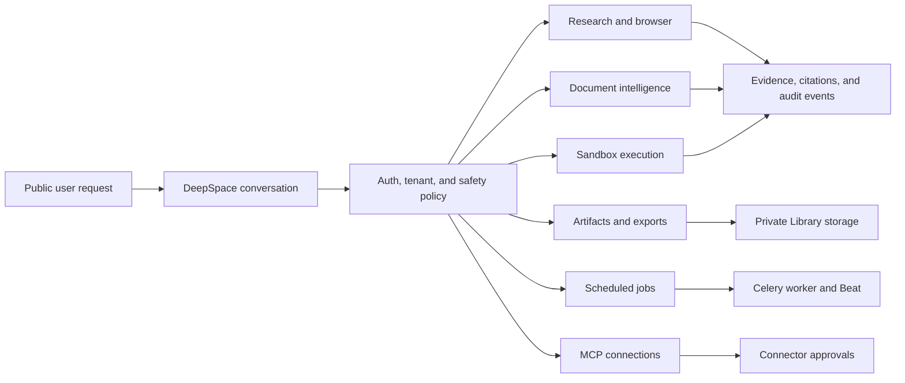

# Advanced capability audit index

Every feature document has a stable numeric audit id. Ordered lists use
explicit Markdown numbering (`1.`, `2.`, `3.`); renderers are expected to
display them as consecutive numbers.

This is the entry point for the six production capability audits. Each
feature has its own document so operators, reviewers, and users can inspect
the logic and the visible behavior independently.

The diagram shows one protected entry point and six capability paths. The
numbered documents below explain each path, its user-facing result, and its
security boundary.

1. [Sandboxed Python/SQL execution](1-sandbox-execution.md)
2. [Rich document intelligence](2-document-intelligence.md)
3. [Controlled browser research](3-browser-research.md)
4. [Artifact generation and exports](4-artifact-generation.md)
5. [Scheduled and long-running work](5-scheduled-jobs.md)
6. [MCP connections](6-mcp-connections.md)

The combined overview remains available in
[advanced-workspace-capabilities.md](advanced-workspace-capabilities.md).
