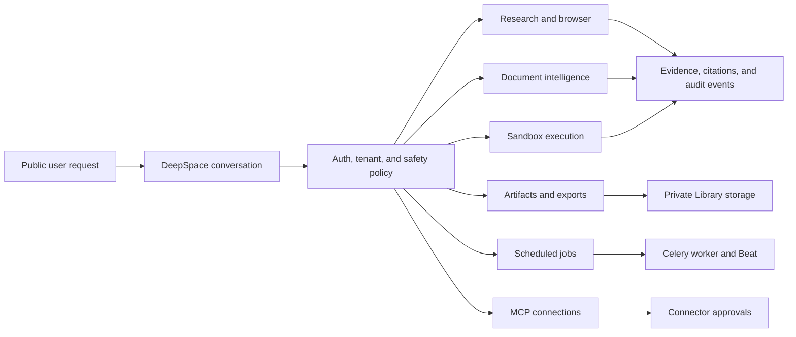

# 09. Advanced capability audit index

Every feature document has a stable numeric audit id. Ordered lists use
explicit Markdown numbering (`1.`, `2.`, `3.`); renderers are expected to
display them as consecutive numbers.

This is the entry point for the advanced capability audits. Each feature has
its own document so operators, reviewers, and users can inspect the logic and
the visible behavior independently. Read the [end-to-end handoff](../release/01-end-to-end-handoff.md)
first for release status and cross-feature dependencies.

1. [End-to-end implementation and release handoff](../release/01-end-to-end-handoff.md)

2. [Storage retention lifecycle: production guide](../storage/02-storage-retention-production-guide.md)

The diagram shows one protected entry point and six capability paths. The
numbered documents below explain each path, its user-facing result, and its
security boundary.

3. [Sandboxed Python/SQL execution](01-sandbox-execution.md)
4. [Rich document intelligence](02-document-intelligence.md)
5. [Controlled browser research](03-browser-research.md)
6. [Artifact generation and exports](04-artifact-generation.md)
7. [Scheduled and long-running work](05-scheduled-jobs.md)
8. [MCP connections](06-mcp-connections.md)

9. [OCR, Library-to-sandbox, RAG, and artifact output](07-ocr-rag-library-sandbox-artifacts.md)
10. [Production end-to-end verification report](../release/02-production-e2e-verification.md)

The combined overview remains available in
[10-advanced-workspace-capabilities.md](10-advanced-workspace-capabilities.md).
