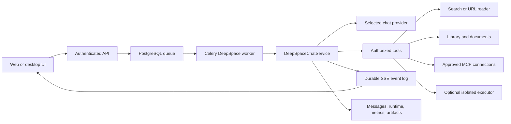

# 01. AverQel end-to-end implementation and release handoff

**Status date:** 2026-09-27
**Scope:** backend, workers, frontend DeepSpace, database migrations, optional
capability services, tests, and operational documentation.

This is the release-status document for the current workspace. The numbered
capability documents describe individual features; this document records how
they connect, what is actually available, and what must be completed before a
GitHub push or deployment is called end-to-end complete.

## 1. End-to-end request path



The browser is a client, not the owner of a DeepSpace run. The API validates
the request, persists the queue record, and starts or resumes a worker. The
worker owns provider calls, tool authorization, runtime checkpoints, durable
events, message persistence, and terminal state. A browser refresh or dropped
SSE connection must reconnect to the same durable request id.

Retention is separate from browser lifecycle. The daily technical cleanup does
not delete DeepSpace conversations, chat messages, active runs, queued turns,
completed answers, or artifacts. The storage lifecycle service provides the
user-selected Off/30/60/90-day metadata-only archive policy in local/staging
profiles, with restore, protection, reconciliation, and lease recovery.
Production/VPS automatic archive and external restore proof remain deployment
gates. See [`02-storage-retention-production-guide.md`](../storage/02-storage-retention-production-guide.md)
for the exact policy.

## 2. Current capability matrix

| Capability | Code exists | End-to-end status | Release note |
|---|---:|---|---|
| Normal DeepSpace chat | Yes | Available | Uses the authenticated API, provider selection, worker, SSE, and durable message history. |
| Clarification and approval resume | Yes | Available in worktree; needs release regression | Answers reuse the paused run and original request id. |
| Composer queue and steer | Yes | Available in worktree; needs migration and load validation | Queue records are tenant/user/conversation scoped. |
| Provider-aware reasoning and context limits | Yes | Available in worktree; needs provider matrix validation | Provider-specific request shaping must remain capability-aware. |
| Operational metrics and provider circuit | Yes | Available in worktree; needs migration and dashboard validation | Metrics must remain tenant-safe and must not contain prompts or secrets. |
| Library, document, OCR, dataset, and artifact workflows | Yes | Available | See documents 1, 2, 4, 8, 10, 11, and 13. |
| Web search | Yes | Available when a web provider is configured | Search returns normalized result metadata and snippets. |
| Static webpage text extraction | Yes | Available locally | `url_read` is exposed through normal research routing and is covered by routing, SSRF, redirect, size, and citation tests. |
| JavaScript webpage extraction | Yes | Available locally; deployment gate remains | The isolated Chromium renderer and egress profile are active locally and rendered a public HTTPS page with HTTP 200. External staging/VPS proof remains separate. |
| MCP connections | Yes | Available when connected and approved | Reads may run automatically; side effects require approval. |
| Sandboxed Python/SQL | Yes | Available locally; deployment gate remains | The isolated executor is healthy and an authenticated bounded Python smoke test returned `4`. |
| Voice | Yes | Local authenticated browser smoke passed; physical-device and deployment proof remain | Disposable local Playwright checks passed over HTTPS/WSS with fake microphone input for STT and local TTS. A physical microphone/browser and external staging/VPS proof remain separate gates. |
| LM Studio provider | Yes | Local adapter and embedding smoke passed | The loaded `lfm2.5-8b-a1b` model returned visible chat content and usage; local embeddings returned 768 dimensions. External providers still require their own valid credentials and policy entitlement. |
| Scheduled jobs | Yes | Available when scheduler and migrations are deployed | Beat and worker must be enabled only after migration validation. |

“Code exists” does not mean a feature is ready to advertise. A feature is
release-ready only when its route, worker path, authorization boundary,
frontend state, migration, tests, and deployment instructions agree.

## 3. Database changes in the current worktree

The current uncommitted work adds or updates durable runtime state. Apply and
verify migrations before starting workers that depend on these tables:

- `20260916_0001_deepspace_queued_turns.py`
- `20260916_0002_deepspace_request_metrics.py`
- `20260917_0001_cascade_deepspace_runtime_and_snapshots.py`
- `20260918_0001_deepspace_context_summaries.py`
- `20260920_0001_deepspace_context_epochs.py`
- `20260922_0001_deepspace_queue_controls.py`
- `20260923_0001_deepspace_checkpoint_retries.py`
- `20260924_0001_tenant_storage_allocations.py`
- `20260925_0001_storage_retention_lifecycle.py`
- `20260926_0001_storage_reservations_archive_reconciliation.py`
- `20260927_0001_retention_checkpoints.py`
- `20260928_0001_retention_protections_and_run_links.py`

The current Documents Hub chain continues with:

- `20260929_0001_deepspace_conversation_retrieval_index.py`
- `20260930_0001_deepspace_turn_attachments.py`
- `20261001_0001_document_security_scan_receipts.py`
- `20261002_0001_ingestion_checkpoints.py`
- `20261003_0001_document_organization.py`
- `20261004_0001_document_shares.py`
- `20261005_0001_document_webhooks.py`
- `20261006_0001_document_links_and_ai.py`
- `20261007_0001_document_automation.py`
- `20261008_0001_comment_mentions.py`
- `20261009_0001_document_webhook_deliveries.py`

The existing runtime, schedule, artifact, MCP, and Library migrations remain
part of the same ordered Alembic history. Never manually reorder migration
files or start a production worker against a database that has not been
migrated.

## 4. Webpage reading: required implementation

The intended research flow is:

```text
User asks for current research
  -> web_search finds candidate URLs
  -> url_read fetches a selected public page
  -> optional browser renderer handles JavaScript content
  -> bounded text is returned to the model
  -> citations identify fetched sources
```

The current code contains:

- `WEB_SEARCH_TOOL` and the configured search-provider path;
- `URL_READ_TOOL` and `read_url()` with SSRF, redirect, size, and content-type
  checks;
- `browser_reader.py`, Chromium, and the `research-browser` Compose profile.
- The normal research route exposes `web_search` and `url_read` together, and
  direct HTTPS prompts expose `url_read` even when search-provider selection is
  unavailable.
- URL reads return bounded text, title, links, final URL, retrieval method, and
  a citation. Empty JavaScript shells use the isolated browser only when it is
  explicitly enabled.
- Tests cover search→read, direct URL routing, HTTPS/SSRF blocking, static
  extraction, browser fallback, and fetched citations.

The security boundary remains unchanged: HTTPS-only public targets, configured
domain allowlists, per-hop redirect validation, bounded timeouts and response
size, no cookies or logins, and no private-network access.

## 5. Configuration and deployment order

1. Prepare PostgreSQL, Redis, MinIO, API, worker, and frontend configuration.
2. Configure a permitted chat provider and, separately, a web-search provider.
3. Run `alembic upgrade head` from the backend release image.
4. Start API and workers and verify `/api/v1/health/live` and
   `/api/v1/health/ready`.
5. Enable optional sandbox execution only with its isolated profile and token.
6. Enable `research-browser` only after Chromium, Squid, bearer authentication,
   SSRF blocking, and public-page smoke tests pass.
7. Run authenticated frontend and DeepSpace end-to-end tests in staging.
8. Review metrics, queue depth, failure rate, p50/p95 latency, and worker
   logs before production activation.

The default deployment must remain safe when optional browser and sandbox
profiles are disabled. A missing optional capability must produce a clear
unavailable result, never fabricated evidence or an unsafe fallback.

## 6. Verification commands

Run from `backend` with the project virtual environment:

```bash
source .venv/bin/activate
pytest -q tests/unit/test_deepspace_chat_service.py
pytest -q tests/unit/test_deepspace_runtime.py tests/unit/test_deepspace_run_events.py
pytest -q tests/unit/test_deepspace_tool_profiles.py tests/unit/test_provider_context_transport.py
pytest -q tests/unit tests/integration tests/security tests/e2e -n 4
```

Run the frontend checks from `frontend` using the repository package scripts:

```bash
pnpm test
pnpm exec tsc --noEmit
pnpm exec eslint .
pnpm build
```

## 7. Current local verification (2026-09-27)

The following checks were run against the current local worktree:

| Check | Result |
| --- | --- |
| Applied migration head | `20261009_0001_document_webhook_deliveries` |
| Focused retention/browser/sandbox workflow | 17 passed |
| Complete backend suite | Passed at 100% with no failures |
| Complete frontend suite | 88 files, 325 tests passed |
| Complete Playwright suite | 10 passed, 0 skipped |
| Frontend TypeScript | Passed |
| Frontend ESLint | Passed |
| Production frontend build | Passed; all dashboard and storage/plan routes generated |
| PostgreSQL restore proof | Disposable restore succeeded; 83 public tables verified |
| MinIO restore proof | Disposable volume restored; 150 files and health HTTP 200 verified |
| Sandbox profile | Healthy; authenticated bounded Python returned `4` |
| Browser profile | Healthy; authenticated public HTTPS render returned HTTP 200 |
| LiveKit voice agent | Registered with local LiveKit; no 401 retry loop after credential alignment |
| Voice browser smoke | Passed locally with disposable account, HTTPS/WSS, fake microphone STT, and TTS audio track |
| LM Studio chat/embedding smoke | Passed locally with visible chat output and 768-dimensional embeddings |

The restore database, proof volume, and proof container were removed after
verification. The active PostgreSQL and MinIO volumes were not overwritten.
Provider live generation remains dependent on valid provider credentials and
upstream provider policy. The local LM Studio provider is verified; OpenZen's
free tier remains blocked by its client-only upstream policy. VPS deployment
and external staging proof were not performed.

Run the URL/browser smoke checks only against staging or a disposable local
environment. Do not put provider credentials, tenant identifiers, prompts, or
private files in test output.

The Documents Hub browser suite verifies quarantine review, webhook delivery
history, expiring share-link resolution, and citation page preview/zoom. Its
fixture-backed API routing is intentionally deterministic; live staging must
still repeat the same workflows with real storage, workers, scanner, and
tenant data.

## 8. Release gate

Before committing or pushing:

- the working tree is reviewed and generated files are excluded;
- every new migration applies cleanly to a fresh database and upgrades an
  existing database;
- backend, frontend, and focused end-to-end tests pass;
- `url_read` behavior is either fully wired and tested or explicitly marked
  unavailable;
- browser and sandbox profiles are tested only when enabled;
- deleted files have confirmed replacements and no stale imports;
- docs match the actual tool routing and deployment state;
- commits are separated by logical feature or fix;
- the final diff and commit list are reviewed before `git push`.

The manual semantic-release workflow accepts an explicit canonical
`release_version` input. To publish the requested patch release after the PR
is merged to `main`, run it with `release_version=v1.2.20`; the workflow still
validates the `vMAJOR.MINOR.PATCH` format before tagging.

The local code and verification gate is cleared for this worktree. External
deployment remains gated on applying the migration and repeating the restore,
tenant-isolation, authenticated DeepSpace, queue/retry/approval/reload, and
real-device voice checks in isolated staging/VPS. Production automatic archive
and permanent purge remain disabled.
